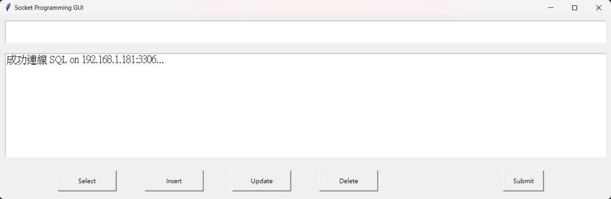
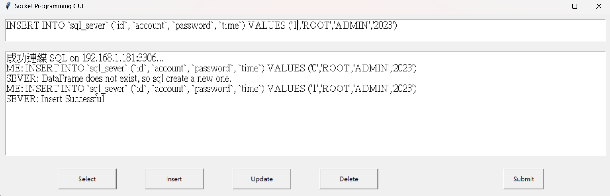
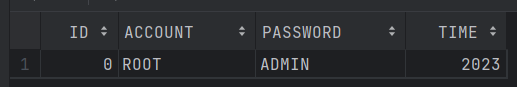
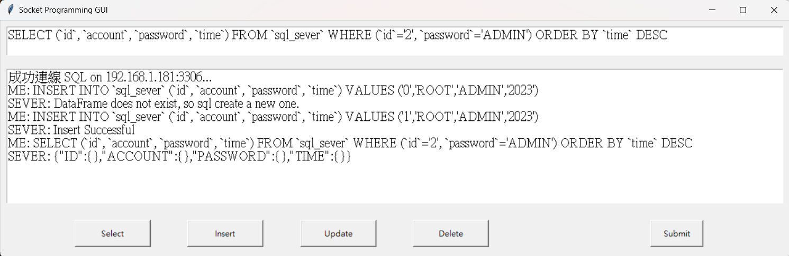
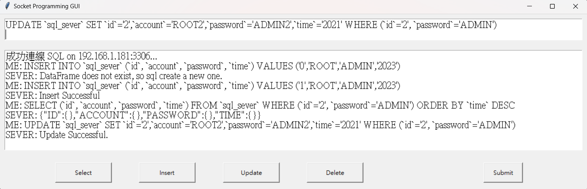
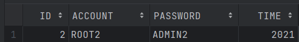
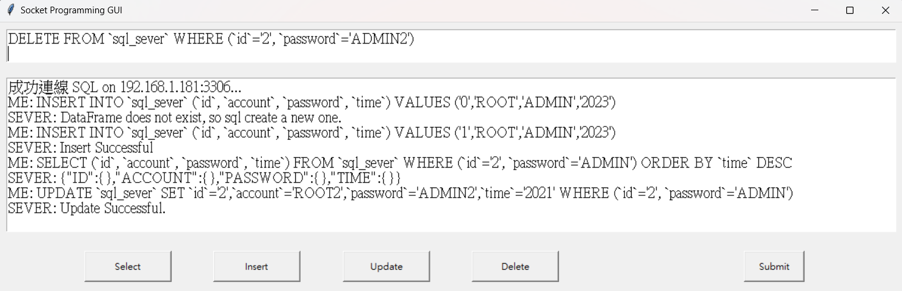
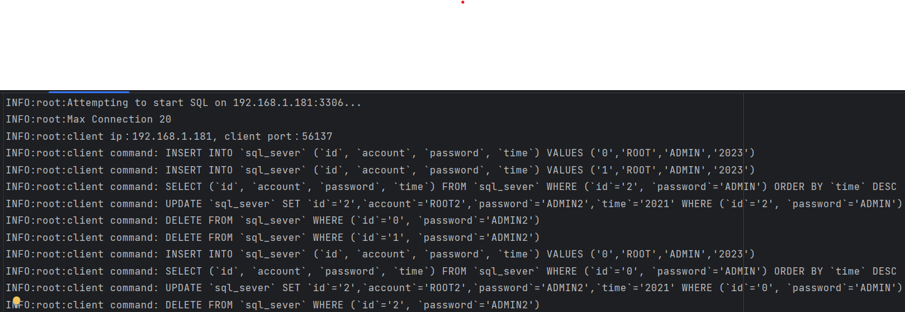

# Socket Programming

## 前置作業
### 使用版本 python 3.10
### 使用套件
```sh
pip install -r ./requirements.txt
```
### 更新設定檔
1. 執行 python 檔案取得 host ip  `python get_host.py`
2. 更新 config.ini 的 `host = 192.168.1.181`

## 檔案架構
```
├── client1.py // client1, client2 的程式是一樣的，模擬多個使用者同時使用 
├── client2.py
├── config.ini // 初始化設定檔，只要更改 host 即可 
├── get_host.py // 可以取得當前電腦的 host name
├── report.md
├── requirements.txt
└── sever.py // sql sever
```

## DEMO
### 使用情境
* Client 端初始化<br>


* Client 新增資料<br>


* Sever 新增資料<br>



* Client 選取資料<br>


* Sever 回傳資料並在下面 log 視窗顯示<br>


* Client 更新資料<br>


* Sever 更新資料<br>



* Client 刪除資料<br>


* Sever 更新資料<br>


* Sever Log 檔案<br>


## 程式碼講解 
### SEVER 端
```py
class SocketSever:
    # 初始化
    def __init__(self, host, port, backlog):
    # 初始化
    def _init_host(self):
    # 連線邏輯, 例外處理邏輯
    def _start_connection(self):
    # sql 例外處理邏輯
    def _handle_sql(self, command):
    # 插入邏輯
    def _insert(self, statement):
    # 選擇邏輯
    def _select(self, statement):
    # 更新邏輯
    def _update(self, statement):
    # 刪除邏輯
    def _delete(self, statement):
    # regular expression 解析 SQL 語法
    def match_all(r, s):
    # 建立 regular expression 物件
    def reg_get(x, s):
    # CSV 資料讀取
    def df_read(name):
    # CSV 資料存取
    def df_save(df, name):
    # CSV 例外檢查
    def not_found(name):
    # 資料處裡
    def s_comma_equal(l):
    # 資料處裡
    def clean_sep_char(s): 

# 讀取初始化 config, log 檔案
if __name__ == "__main__":  
```
### CLIENT 端
```py
class SocketClient:
    def __init__(self, host, port, socket_client_GUI):
    # 傳送 socket 通訊
    def send(self, msg):

class SocketClientGUI:
    def __init__(self):
    # 建立 socket 物件
    def _socket_start(self):
    # 處理 output 面板
    def _output(self, string):
    # 處理 log 面板
    def _log(self, string):
    # 顯示選擇模板
    def _select_template(self):
    # 顯示插入模板
    def _insert_template(self):
    # 顯示更新模板
    def _update_template(self):
    # 顯示刪除模板
    def _delete_template(self):
    # 處理表單送出邏輯
    def _on_submit(self):

# 讀取初始化 config, log 檔案
if __name__ == "__main__":
```

## 技術細節
### re 處理模組
```py
def match_all(r, s):
    reg = re.match(r, s)
    mat = reg and reg.group() == s
    if not mat: return None
    reg_dict = reg.groupdict()
    for k, v in reg_dict.items():
        if v is None: reg_dict[k] = ''
    return reg_dict

@staticmethod
def reg_get(x, s):
    return s if x is None else r'(?P<' + x + '>' + s + r')'
```

### re 處理模組
```py
def match_all(r, s):
    reg = re.match(r, s)
    mat = reg and reg.group() == s
    if not mat: return None
    reg_dict = reg.groupdict()
    for k, v in reg_dict.items():
        if v is None: reg_dict[k] = ''
    return reg_dict

@staticmethod
def reg_get(x, s):
    return s if x is None else r'(?P<' + x + '>' + s + r')'
```

### None Blocking, Multi Client Connection, Sql Atomic Operation
```py
def _start_connection(self):
    clients = []
    while True:
        try:
            client, addr = self.server_socket.accept()
            logging.info(f'client ip：{addr[0]}, client port：{addr[1]}')
            client.setblocking(False)
            clients.append(client)
        except:
            pass

        for client in clients:
            try:
                command = client.recv(2048).decode('utf8')
                logging.info(f'client command: {command}')
                reply = self._handle_sql(command)
                if "sql sever error" in reply:
                    reply = "SEVER ERROR, CONNECTION WILL BE CLOSED NOW."
                    logging.info(f'sever reply: {reply}')
                    client.send(reply.encode())
                    client.close()
                else:
                    client.send(reply.encode())
            except:
                pass
```

## 達成
- [x] TCP 程式
- [x] GUI 介面
- [x] 多 client 連接
- [x] Non Blocking Socket 
- [x] SQL 功能